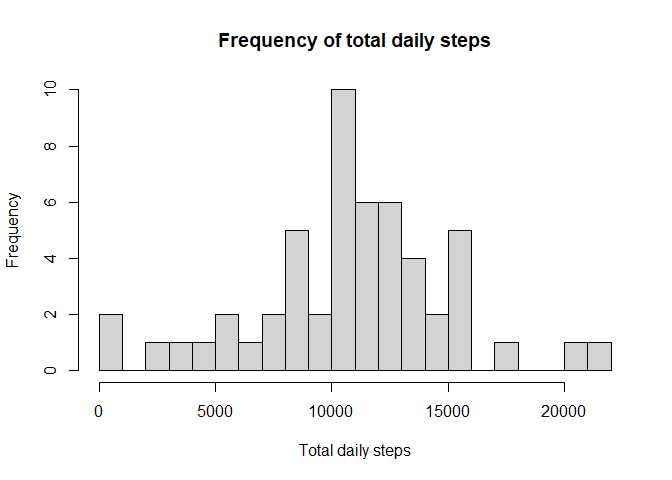
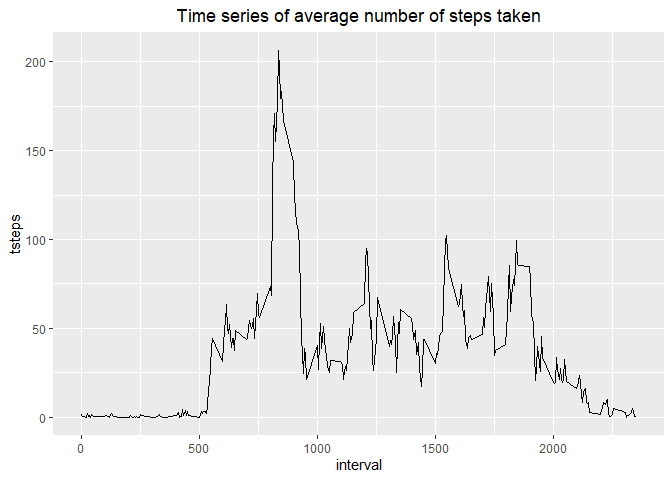
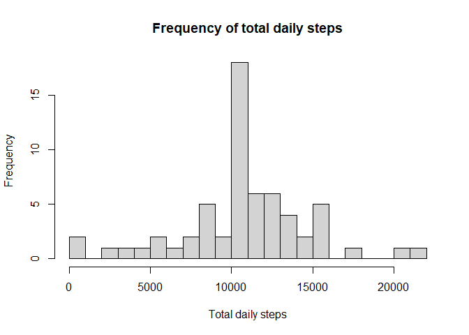
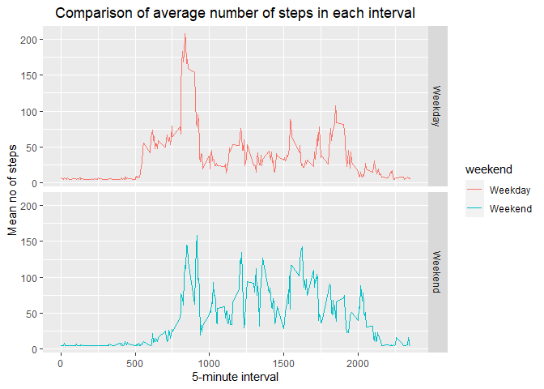

##### **_Loading the necessary libraries :_**

```r
library(ggplot2)
library(dplyr)
```

```
## 
## Attaching package: 'dplyr'
```

```
## The following objects are masked from 'package:stats':
## 
##     filter, lag
```

```
## The following objects are masked from 'package:base':
## 
##     intersect, setdiff, setequal, union
```

## **Loading and preprocessing the data**

```r
activity_data <- read.csv("activity.csv")
head(activity_data)
```

```
##   steps       date interval
## 1    NA 2012-10-01        0
## 2    NA 2012-10-01        5
## 3    NA 2012-10-01       10
## 4    NA 2012-10-01       15
## 5    NA 2012-10-01       20
## 6    NA 2012-10-01       25
```

##### **_Creating a histogram of number of steps taken each day :_**

```r
databydate <- activity_data %>% 
    select(date, steps) %>% 
    group_by(date) %>%
    summarise(tsteps=sum(steps)) %>%
    filter(!is.na(tsteps))
```

```
## `summarise()` ungrouping output (override with `.groups` argument)
```

```r
hist(databydate$tsteps, xlab="Total daily steps", 
     main="Frequency of total daily steps", breaks = 20)
```

<!-- -->

### **What is mean and median total number of steps taken per day?**

```r
avg = mean(databydate$tsteps)
middle = median(databydate$tsteps)
```

* Mean : 1.0766189\times 10^{4}
* Median : 10765`


### **What is the average daily activity pattern?**

```r
databyinterval <- activity_data %>%
    select(interval, steps) %>% 
    filter(!is.na(steps)) %>%
    group_by(interval) %>%
    summarise(tsteps=mean(steps))
```

```
## `summarise()` ungrouping output (override with `.groups` argument)
```

```r
g <- ggplot(databyinterval, aes(x=interval, y=tsteps)) +
        geom_line() 
    
g + ggtitle("Time series of average number of steps taken") +
    theme(plot.title = element_text(hjust=0.5))
```

<!-- -->

### **_The 5-minute interval that, on average, contains the maximum number of steps:_**

```r
max_steps <- databyinterval[which(databyinterval$tsteps == max(databyinterval$tsteps)),] 
```
* *maximum number of steps occurred at __835__*

## **Imputing missing values**

##### **1. Calculating number of missing values**

```r
num_of_na_values <- sum(is.na(activity_data))
```

* *There are __2304__ missing values in the data-set.*

##### **2. Creating a new dataset by removing the missing values**

```r
new_data <- activity_data

for(i in 1:ncol(new_data)){
    new_data[is.na(new_data[,i]), i] <- mean(new_data[,i], na.rm = TRUE)
}
```

```
## Warning in mean.default(new_data[, i], na.rm = TRUE): argument is not numeric or
## logical: returning NA
```

```r
head(new_data)
```

```
##     steps       date interval
## 1 37.3826 2012-10-01        0
## 2 37.3826 2012-10-01        5
## 3 37.3826 2012-10-01       10
## 4 37.3826 2012-10-01       15
## 5 37.3826 2012-10-01       20
## 6 37.3826 2012-10-01       25
```

##### ***3.Creating a histogram***

```r
new_databydate <- new_data %>% 
    select(date, steps) %>% 
    group_by(date) %>%
    summarise(tsteps=sum(steps))
```

```
## `summarise()` ungrouping output (override with `.groups` argument)
```

```r
hist(new_databydate$tsteps, xlab="Total daily steps", 
     main="Frequency of total daily steps", breaks = 20)
```

<!-- -->

#### **4.Checking the mean and median of new_data**

```r
new_avg = mean(new_databydate$tsteps)
new_middle = median(new_databydate$tsteps)
```

- **Do these values differ from the estimates from the first part of the assignment? What is the impact of imputing missing data on the estimates of the total daily number of steps?**

- We know that 
  - New mean : 1.0766189\times 10^{4} and Old mean : 1.0766189\times 10^{4}
  - New median : 1.0766189\times 10^{4} and Old median : 10765

So, the *median* has an impact on adding the missing values but not the *mean*.

### **Are there differences in activity patterns between weekdays and weekends?**

```r
new_data$date <- as.Date(new_data$date)
new_data$weekday <- weekdays(new_data$date)
new_data$weekend <- ifelse(new_data$weekday=="Saturday" | new_data$weekday=="Sunday", 
                           "Weekend", "Weekday")

averages <- aggregate(steps ~ interval + weekend, data =new_data, mean)

ggplot(averages, aes(x=interval, y=steps, color=weekend)) + 
    geom_line() + facet_grid(weekend ~ .) +
    labs(x="5-minute interval", y="Mean no of steps",
         title="Comparison of average number of steps in each interval")+
  theme(plot.title = element_text(hjust=0.5))
```

<!-- -->

